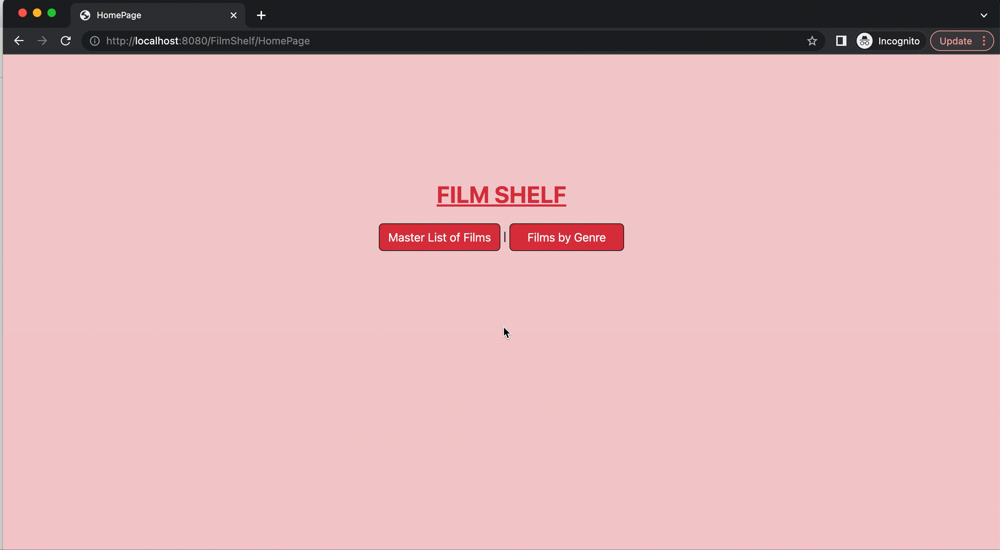
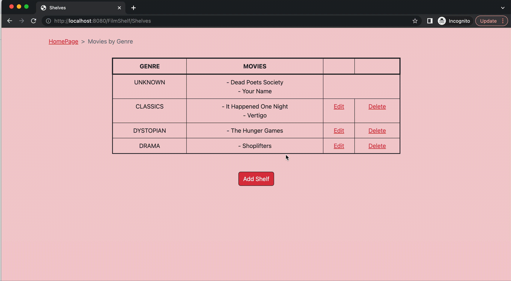
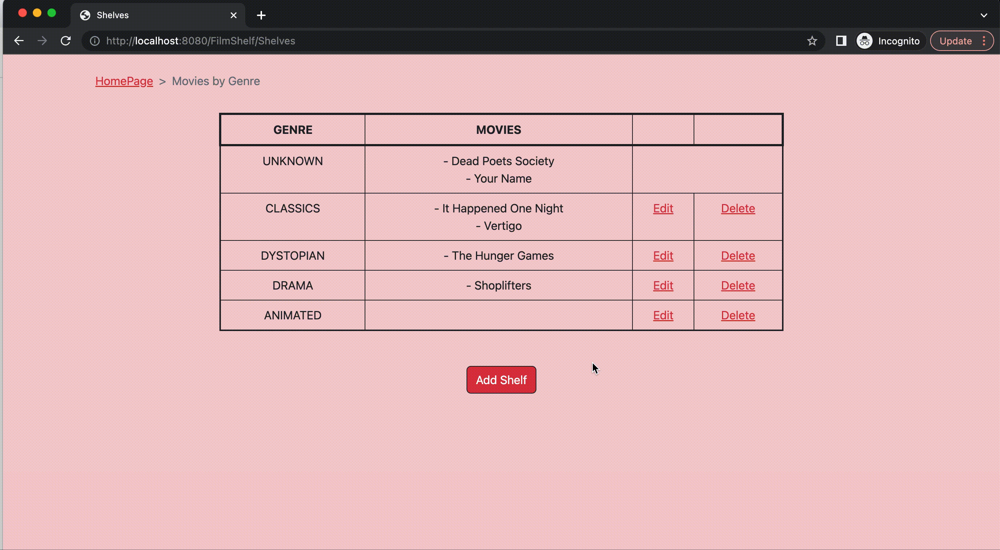

# FilmShelf
Website enables users to add films to a watchlist and allows them to update their “watched” status, as well as other details, on each film.

## About the Project

  
## Features

### MasterList of Films

#### Add New Movie
Users are allowed to add new movies to their film shelf. They have the option to fill in the details (year released, director, watched?, genre)

#### Edit Exsisting Movie
Users can edit existing movies. (For example, they now know who the director is or they now know when the film was released).

#### Delete Movie
Users can delete movies on their shelf.

### Films by Genres

#### Add New Genre
Users can add new genre's as needed.

#### Edit Existing Genre/Films

Users are allowed to edit existing genre names. They are also allowed to remove films from a genre (this action would place the film in the 'Unknown' genre).

#### Delete Genre
Users can delete entire genre's. Preexisting films will be moved into the 'Unknown' genre.

### Built Using
- Eclipse
- Java Servlets (MVC structure)
- HTML
- Bootstrap

### Contact
Any comments, questions, or concerns?
Contact Jacqueline Molina: molina.jq19@gmail.com
